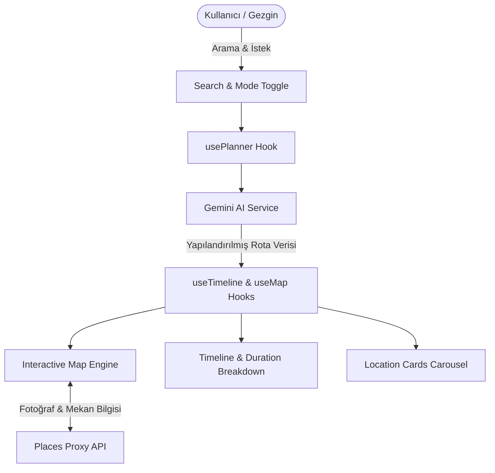

# 🗺️ AI Map Planner & Spatial Itinerary Guide

[](https://www.typescriptlang.org/)
[](https://vitejs.dev/)
[](https://deepmind.google/technologies/gemini/)
[](https://leafletjs.com/)
[](https://www.yucelgumus.dev/)

> Kullanıcıların seyahat, gezi ve keşif hedeflerini **Google Gemini AI** ile akıllı gezi rotalarına, zaman çizelgelerine (timeline) ve harita üzeri interaktif durak kartlarına dönüştüren modern coğrafi planlama platformu.

---

## 🌟 Öne Çıkan Özellikler

- 🧭 **Yapay Zeka Destekli Rota Oluşturucu:** *"İstanbul'da 2 günlük tarihi ve gastronomik rota çiz"* gibi serbest metin isteklerini optimize edilmiş coğrafi koordinatlı duraklara dönüştürür.
- ⏱️ **İnteraktif Zaman Çizelgesi (Timeline):** Her bir durağın ziyaret süresini, önerilen saatini, ulaşım yöntemini (yürüme, toplu taşıma, araç) ve mesafe hesaplamalarını dinamik gösterir.
- 🎴 **Konum Kartları & Karusel (Location Cards):** Mekan fotoğrafları, puanları, tarihi bilgileri ve ipuçlarını içeren zengin kart bileşenleri.
- 📡 **Google Places & Maps Interceptor:** Mekanların yüksek kaliteli fotoğraflarını ve mekan detaylarını çeken güvenli API proxy katmanı (`api/places/photo.ts`).
- 💾 **Dışa Aktarma & Paylaşım:** Oluşturulan seyahat planlarını farklı formatlarda dışa aktarma (`export.utils.ts`).
- ⚡ **Modüler TypeScript Mimarisi:** Custom hook (`usePlanner`, `useTimeline`, `useMap`) ve servis katmanı ayrımı ile yüksek performans.

---

## 🏗️ Mimari & Modül Yapısı



| Modül | Görev |
| :--- | :--- |
| **`src/services/ai.service.ts`** | Gemini AI ile rota oluşturma ve mekan analizi |
| **`src/components/Map/`** | Harita render motoru, marker çizimi ve rota çizgileri |
| **`src/components/Timeline/`** | Zaman çizelgesi, durak sıralaması ve ulaşım detayları |
| **`src/utils/route.utils.ts`** | Koordinatlar arası mesafe ve rota optimizasyonu |
| **`api/places/photo.ts`** | Mekan fotoğraflarını güvenle çeken serverless API |

---

## 🚀 Hızlı Başlangıç

### Gereksinimler
- **Node.js**: v18.0 veya üstü
- **Google Gemini API Key**

### Kurulum

```bash
# Depoyu klonlayın
git clone https://github.com/yucel-gumus/ai_map_planning_and_info.git
cd ai_map_planning_and_info

# Bağımlılıkları yükleyin
npm install
```

### Ortam Değişkenleri (`.env`)

Proje kök dizininde `.env` dosyası oluşturun:

```env
VITE_GEMINI_API_KEY=your_gemini_api_key_here
```

### Uygulamayı Çalıştırma

```bash
# Geliştirme sunucusunu başlatın
npm run dev
```

Uygulama `http://localhost:5173` adresinde çalışacaktır.

---

## 📂 Proje Dizin Yapısı

```
ai_map_planning_and_info/
├── api/
│   ├── generate-map.ts             # Harita üretim serverless fonksiyonu
│   └── places/photo.ts             # Mekan fotoğrafları proxy API
├── index.html
├── package.json
├── vite.config.ts
└── src/
    ├── main.ts
    ├── app.ts
    ├── types/                      # Rota, konum ve UI tipleri
    ├── constants/                  # Harita ve AI sabitleri
    ├── services/
    │   ├── ai.service.ts           # Gemini planlama servisi
    │   ├── map.service.ts          # Harita servisleri
    │   └── image.service.ts        # Fotoğraf servisleri
    ├── hooks/
    │   ├── usePlanner.ts           # Rota planlayıcı hook
    │   ├── useTimeline.ts          # Zaman çizelgesi hook
    │   └── useMap.ts               # Harita state hook
    ├── components/
    │   ├── Search/                 # Arama çubuğu ve mod seçici
    │   ├── Map/                    # Harita konteyneri
    │   ├── Timeline/               # Zaman çizelgesi bileşenleri
    │   ├── Cards/                  # Mekan kartları & karusel
    │   └── Modal/                  # Yardım ve bilgilendirme modalları
    └── styles/                     # CSS değişkenleri ve modüler stiller
```

---

## 📄 Lisans
Bu proje [MIT Lisansı](LICENSE) ile lisanslanmıştır.

---

## 👨‍💻 Geliştirici & İletişim

**Yücel Gümüş** - Full Stack Developer

- 🌐 **Web Sitesi / Portfolyo:** [yucelgumus.dev](https://www.yucelgumus.dev/)
- 💼 **LinkedIn:** [linkedin.com/in/yucel-gumus](https://www.linkedin.com/in/yucel-gumus/)
- 🐙 **GitHub:** [@yucel-gumus](https://github.com/yucel-gumus)

<p align="left">
  <a href="https://www.yucelgumus.dev/" target="_blank" rel="noopener noreferrer">
    
  </a>
</p>
